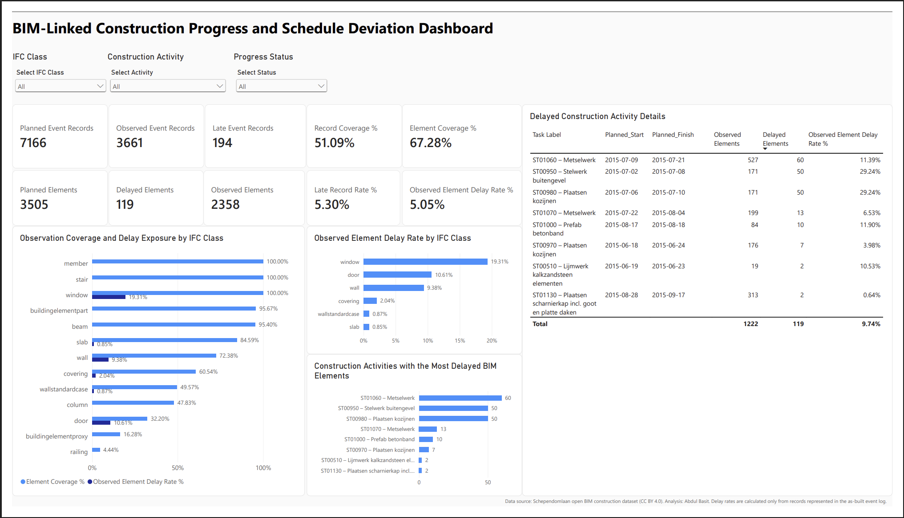

# BIM-Linked Construction Progress and Schedule Deviation Analysis

An end-to-end construction analytics project that integrates an IFC-based BIM model with planned and as-built event logs to evaluate progress coverage, identify delayed building elements, and examine how schedule deviations are distributed across BIM element classes and construction activities.

The project uses the open Schependomlaan construction dataset and combines Python-based data preparation with an interactive Power BI dashboard.

## Project Objective

Construction schedules, BIM models, and field progress records are often stored separately. This project demonstrates a traceable workflow for connecting these sources through IFC Global Unique Identifiers (GUIDs) and task identifiers.

The analysis addresses four questions:

1. How completely is the planned BIM scope represented in the as-built event log?
2. Which BIM element classes show the greatest observed delay exposure?
3. Which construction activities contain the most delayed elements?
4. Which elements appear in more than one delayed activity?

## Data Integration Workflow

1. Audited and cleaned the planned and as-built event logs.
2. Extracted element attributes and GUIDs from IFC models using IfcOpenShell.
3. Tested the original design IFC against the event logs and found no GUID correspondence.
4. Identified the schedule-enriched as-planned IFC as the correct integration source.
5. Joined BIM elements to both event logs using GUIDs, achieving 100% GUID match coverage for the usable records.
6. Standardized IFC class labels while preserving the original event-log classifications.
7. Calculated progress coverage, delay exposure, task-level metrics, and repeated delay associations.
8. Prepared a star-schema dataset and interactive Power BI dashboard.

## Key Results

| Metric | Result |
| --- | ---: |
| Planned element-task records | 7,166 |
| Observed element-task records | 3,661 |
| Planned unique BIM elements | 3,505 |
| Observed unique BIM elements | 2,358 |
| Late element-task records | 194 |
| Unique BIM elements affected by delay | 119 |
| Record coverage | 51.09% |
| Element coverage | 67.28% |
| Late-record rate among observed records | 5.30% |
| Observed-element delay rate | 5.05% |

### Main findings

- Windows had the highest observed-element delay rate at 19.31%, followed by doors at 10.61% and walls at 9.38%.
- ST01060 - Metselwerk contained the most delayed BIM elements (60).
- ST00950 - Stelwerk buitengevel and ST00980 - Plaatsen kozijnen each contained 50 delayed elements.
- Of the 119 unique delayed elements, 75 appeared in two delayed activities and 44 appeared in one.
- Observation coverage varied substantially by IFC class. Therefore, a zero recorded delay should not automatically be interpreted as good performance when class coverage is low.

## Dashboard

The Power BI dashboard includes:

- Planned, observed, and late event-record KPIs
- Planned, observed, and delayed element KPIs
- Record and element observation coverage
- Delay rates by IFC class
- Activities containing the most delayed elements
- Task-level dates, observed elements, delayed elements, and delay rates
- Interactive filters for IFC class, construction activity, and progress status

The Power BI data model uses:

- `Fact_ProgressEvents` as the event-level fact table
- `Dim_Elements` as the BIM element dimension
- `Dim_Tasks` as the construction activity dimension

## Repository Structure

| Location | Contents |
| --- | --- |
| `notebooks/` | Data audit, IFC extraction, integration, analysis, and Power BI preparation notebooks |
| `data/processed/` | Cleaned and derived CSV files used in the analysis |
| `dashboard/` | Power BI report and exported dashboard PDF |
| `figures/` | Dashboard preview and analytical figures |

## Notebook Sequence

1. `01_data_audit_and_cleaning.ipynb`
2. `02_design_ifc_extraction.ipynb`
3. `02B_asplanned_ifc_extraction.ipynb`
4. `03_bim_event_log_integration.ipynb`
5. `04_progress_and_delay_analysis.ipynb`
6. `05_powerbi_data_preparation.ipynb`

## Tools and Technologies

- Python
- pandas
- IfcOpenShell
- Matplotlib and Seaborn
- Power BI
- DAX
- Google Colab
- Industry Foundation Classes (IFC)

## Reproducing the Analysis

1. Download the complete Schependomlaan dataset from its source repository.
2. Open the notebooks in Google Colab or a compatible Jupyter environment.
3. Run the notebooks in numerical order.
4. Update file paths when prompted to point to the downloaded raw files.
5. Import the three Power BI output tables into Power BI Desktop:
   - `Fact_ProgressEvents.csv`
   - `Dim_Elements.csv`
   - `Dim_Tasks.csv`
6. Open the included `.pbix` file to inspect the finished data model and dashboard.

## Interpretation and Limitations

- The as-built event log provides categorical status labels (`On time` and `Too late`) but does not provide reliable actual completion dates or the number of days delayed.
- Records absent from the as-built event log are reported as **Not represented in as-built log**. They are not classified as incomplete, on time, or delayed.
- Delay rates are calculated only from records or elements represented in the as-built event log.
- Multiple delayed task associations for the same element indicate repeated exposure across activities; they do not establish causal relationships between tasks.
- IFC class mismatches reflect differences between event-log terminology and modeled IFC classes. The BIM class is retained as the canonical class while the original classifications remain available for auditability.
- The findings describe this case-study dataset and should not be generalized to the construction industry without additional projects and validation.

## Data Source and Attribution

This project uses the [Schependomlaan open BIM dataset](https://github.com/jakob-beetz/DataSetSchependomlaan), collected during a master's thesis project at the Information Systems for the Built Environment group at Eindhoven University of Technology in collaboration with project and industry partners.

The source repository states that the data owners permitted use for scientific and academic purposes. The dataset materials used in this project are attributed under CC BY 4.0. The original large IFC, point-cloud, image, video, and coordination-model files are not redistributed in this repository.

## Author

**Abdul Basit**  
Background in architecture, BIM, construction practice, and business analytics.

